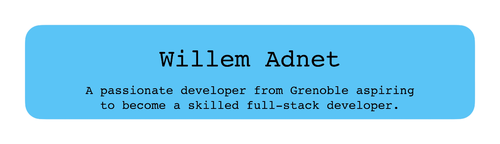

  

<h1 align="center" style="width: 100%; text-align: center;">
  
</h1>

<h2 align="center">🚀 Languages and Tools I Use</h2>

  <a href="https://raw.githubusercontent.com/devicons/devicon/master/icons/c/c-original.svg">
    <picture>
      <source media="(prefers-color-scheme: dark)" srcset="https://raw.githubusercontent.com/devicons/devicon/master/icons/c/c-original.svg" />
      <source media="(prefers-color-scheme: light)" srcset="https://raw.githubusercontent.com/devicons/devicon/master/icons/c/c-original.svg" />
      
    </picture>
  </a>
  <a href="https://raw.githubusercontent.com/devicons/devicon/master/icons/cplusplus/cplusplus-original.svg">
    <picture>
      <source media="(prefers-color-scheme: dark)" srcset="https://raw.githubusercontent.com/devicons/devicon/master/icons/cplusplus/cplusplus-original.svg" />
      <source media="(prefers-color-scheme: light)" srcset="https://raw.githubusercontent.com/devicons/devicon/master/icons/cplusplus/cplusplus-original.svg" />
      
    </picture>
  </a>

  <a href="https://raw.githubusercontent.com/devicons/devicon/master/icons/swift/swift-original.svg">
    <picture>
      <source media="(prefers-color-scheme: dark)" srcset="https://raw.githubusercontent.com/devicons/devicon/master/icons/swift/swift-original.svg" />
      <source media="(prefers-color-scheme: light)" srcset="https://raw.githubusercontent.com/devicons/devicon/master/icons/swift/swift-original.svg" />
      
    </picture>
  </a>
  <a href="https://developer.apple.com/xcode/swiftui/">
    <picture>
      <source media="(prefers-color-scheme: dark)" srcset="icons8-swiftui.svg" />
      <source media="(prefers-color-scheme: light)" srcset="icons8-swiftui.svg" />
      
    </picture>
  </a>
  <a href="https://raw.githubusercontent.com/devicons/devicon/master/icons/python/python-original.svg">
    <picture>
      <source media="(prefers-color-scheme: dark)" srcset="https://raw.githubusercontent.com/devicons/devicon/master/icons/python/python-original.svg" />
      <source media="(prefers-color-scheme: light)" srcset="https://raw.githubusercontent.com/devicons/devicon/master/icons/python/python-original.svg" />
      
    </picture>
  </a>
  <a href="https://raw.githubusercontent.com/devicons/devicon/master/icons/java/java-original.svg">
    <picture>
      <source media="(prefers-color-scheme: dark)" srcset="https://raw.githubusercontent.com/devicons/devicon/master/icons/java/java-original.svg" />
      <source media="(prefers-color-scheme: light)" srcset="https://raw.githubusercontent.com/devicons/devicon/master/icons/java/java-original.svg" />
      
    </picture>
  </a>
  <a href="https://www.vectorlogo.zone/logos/opencv/opencv-icon.svg">
    <picture>
      <source media="(prefers-color-scheme: dark)" srcset="https://www.vectorlogo.zone/logos/opencv/opencv-icon.svg" />
      <source media="(prefers-color-scheme: light)" srcset="https://www.vectorlogo.zone/logos/opencv/opencv-icon.svg" />
      
    </picture>
  </a>
  <a href="https://raw.githubusercontent.com/devicons/devicon/master/icons/mysql/mysql-original-wordmark.svg">
    <picture>
      <source media="(prefers-color-scheme: dark)" srcset="https://raw.githubusercontent.com/devicons/devicon/master/icons/mysql/mysql-original-wordmark.svg" />
      <source media="(prefers-color-scheme: light)" srcset="https://raw.githubusercontent.com/devicons/devicon/master/icons/mysql/mysql-original-wordmark.svg" />
      
    </picture>
  </a>
  <a href="https://raw.githubusercontent.com/devicons/devicon/master/icons/oracle/oracle-original.svg">
    <picture>
      <source media="(prefers-color-scheme: dark)" srcset="https://raw.githubusercontent.com/devicons/devicon/master/icons/oracle/oracle-original.svg" />
      <source media="(prefers-color-scheme: light)" srcset="https://raw.githubusercontent.com/devicons/devicon/master/icons/oracle/oracle-original.svg" />
      
    </picture>
  </a>
  <a href="https://www.vectorlogo.zone/logos/gnu_bash/gnu_bash-icon.svg">
    <picture>
      <source media="(prefers-color-scheme: dark)" srcset="https://www.vectorlogo.zone/logos/gnu_bash/gnu_bash-icon.svg" />
      <source media="(prefers-color-scheme: light)" srcset="https://www.vectorlogo.zone/logos/gnu_bash/gnu_bash-icon.svg" />
      
    </picture>
  </a>
  <a href="https://raw.githubusercontent.com/devicons/devicon/master/icons/linux/linux-original.svg">
    <picture>
      <source media="(prefers-color-scheme: dark)" srcset="https://raw.githubusercontent.com/devicons/devicon/master/icons/linux/linux-original.svg" />
      <source media="(prefers-color-scheme: light)" srcset="https://raw.githubusercontent.com/devicons/devicon/master/icons/linux/linux-original.svg" />
      
    </picture>
  </a>
  <a href="https://www.vectorlogo.zone/logos/git-scm/git-scm-icon.svg">
    <picture>
      <source media="(prefers-color-scheme: dark)" srcset="https://www.vectorlogo.zone/logos/git-scm/git-scm-icon.svg" />
      <source media="(prefers-color-scheme: light)" srcset="https://www.vectorlogo.zone/logos/git-scm/git-scm-icon.svg" />
      
    </picture>
  </a>
  
  <a href="https://raw.githubusercontent.com/devicons/devicon/master/icons/notion/notion-original.svg">
    <picture>
      <source media="(prefers-color-scheme: dark)" srcset="https://raw.githubusercontent.com/devicons/devicon/master/icons/notion/notion-original.svg" />
      <source media="(prefers-color-scheme: light)" srcset="https://raw.githubusercontent.com/devicons/devicon/master/icons/notion/notion-original.svg" />
      
    </picture>
  </a>
  <a href="https://www.latex-project.org/">
  <picture>
    <source media="(prefers-color-scheme: dark)" srcset="LATEX-WHITE.svg" />
    <source media="(prefers-color-scheme: light)" srcset="LATEX-BLACK.svg" />
    
  </picture>
</a>

<h2 align="center">⚡️ Where to find me</h2>

  
  

<h2 align="center">📊 My GitHub Contributions</h2>

  <picture>
    <source media="(prefers-color-scheme: dark)" srcset="https://raw.githubusercontent.com/Vlor999/Vlor999/main/contribution_animation.svg" />
    <source media="(prefers-color-scheme: light)" srcset="https://raw.githubusercontent.com/Vlor999/Vlor999/main/contribution_animation.svg" />
    
  </picture>

  <picture>
    <source media="(prefers-color-scheme: dark)" srcset="https://github-readme-streak-stats.herokuapp.com/?user=Vlor999&theme=dark" />
    <source media="(prefers-color-scheme: light)" srcset="https://github-readme-streak-stats.herokuapp.com/?user=Vlor999&theme=white" />
    
  </picture>

  <picture>
    <source media="(prefers-color-scheme: dark)" srcset="https://github-readme-stats.vercel.app/api/top-langs?username=Vlor999&show_icons=true&locale=en&layout=compact&theme=dark" />
    <source media="(prefers-color-scheme: light)" srcset="https://github-readme-stats.vercel.app/api/top-langs?username=Vlor999&show_icons=true&locale=en&layout=compact&theme=light" />
    
  </picture>

  <a href="https://icons8.com/icon/3cCrxzZF7LfB/swiftui">SwiftUI</a> icon by <a href="https://icons8.com">Icons8</a>

